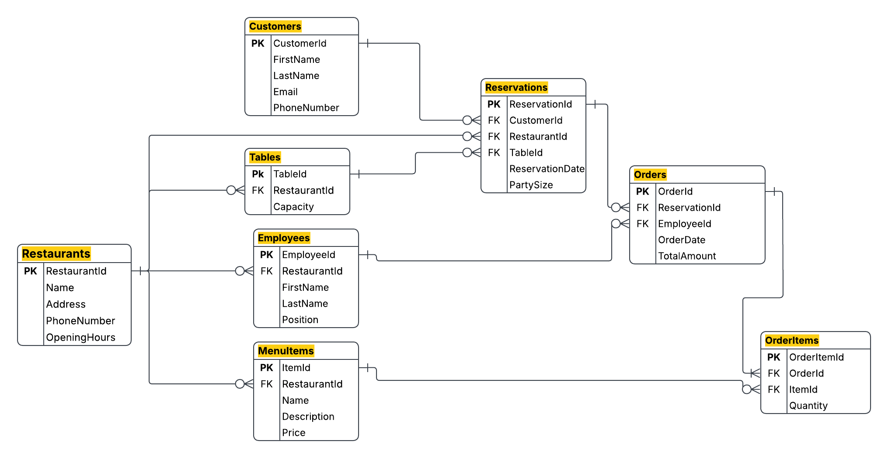

# Restaurant Reservation Management System

A relational database project built using Microsoft SQL Server to manage restaurants, customers, employees, reservations, orders, menu items, and tables.

## Project Overview

This project aims to design and implement a relational database for managing restaurant operations, including reservations, customer information, employees, menu items, orders, and restaurant tables.

The database is designed using Microsoft SQL Server and follows a structured relational model with clearly defined primary keys, foreign keys, relationships, and cardinalities.

## Entity Relationship Diagram

The Entity Relationship Diagram includes the following entities:

- Restaurants
- MenuItems
- Employees
- Customers
- Tables
- Reservations
- Orders
- OrderItems

The diagram defines the relationships between the entities, including primary keys, foreign keys, and one-to-many cardinalities.



## Documentation

- [ERD Analysis](docs/ERD-Analysis.md)

## Database Seeding

The database is populated with consistent and relationally valid sample data using a custom Python data-generation script.

The `generate_seed_data.py` script generates a reusable SQL DML file named `02-seed-data.sql`. The generated SQL file can then be executed directly in Microsoft SQL Server Management Studio (SSMS).

### Generated Records

The seeding process generates the following records:

- **50** Restaurants
- **400** Customers
- **100** Employees
- **100** Restaurant Tables
- **1,000** Menu Items
- **500** Reservations
- **500** Orders
- **1,500** Order Items

### Data Distribution

The generated data follows a consistent distribution:

- Each restaurant has **2** employees.
- Each restaurant has **2** tables.
- Each restaurant has **20** menu items.
- Each restaurant has **10** reservations.
- Each reservation has **1** order.
- Each order contains **3** unique order items.

### Data Consistency

The generator ensures that all relationships and business rules remain valid:

- Employees belong to valid restaurants.
- Tables and menu items belong to valid restaurants.
- Each reservation uses a table from the selected restaurant.
- The reservation party size does not exceed the table capacity.
- Each order is assigned to an employee from the reservation's restaurant.
- Each order item belongs to the same restaurant as its order.
- Duplicate menu items are not added to the same order.
- Order totals are calculated using menu item prices and quantities.
- Customer email addresses are unique.

A fixed random seed (`RANDOM_SEED = 42`) is used so that the exact same dataset is deterministically generated every time the script runs.

### Running the Seeder

From the root or project directory, run the generator script using Python or `uv`:

```bash
# Using standard Python
python generate_seed_data.py

```
## SQL Queries

Each requirement is implemented in a separate SQL file and documented individually.

| # | Requirement | SQL Query | Documentation |
|---|-------------|-----------|---------------|
| 1 | Retrieve all reservations for a specific customer | [View SQL](database/queries/01-list-customer-reservations.sql) | [View Details](docs/queries/01-list-customer-reservations.md) |
| 2 | Retrieve all employees holding the Manager position | [View SQL](database/queries/02-list-managers.sql) | [View Details](docs/queries/02-list-managers.md) |
| 3 | List orders for a specific reservation with their associated menu items | [View SQL](database/queries/03-reservation-orders-menu-items.sql) | [View Details](docs/queries/03-reservation-orders-menu-items.md) |
| 4 | List the menu items ordered by a specific reservation | [View SQL](database/queries/04-ordered-menu-items.sql) | [View Details](docs/queries/04-ordered-menu-items.md) |
| 5 | Calculate the average order amount made through a specific employee | [View SQL](database/queries/05-average-order-amount-by-employee.sql) | [View Details](docs/queries/05-average-order-amount-by-employee.md) |
| 6 | Retrieve reservations report using a view | [View SQL](database/queries/06-reservations-report.sql) | [View Details](docs/queries/06-retrieve-reservations-report.md) |
| 7 | Retrieve employees information with their restaurant details using a view | [View SQL](database/queries/07-retrieve-employees-report.sql) | [View Details](./docs/queries/07-retrieve-employees-report.md) |
| 8 | Identify reservations with two or more orders using a CTE | [View SQL](./database/queries/08-reservations-with-multiple-orders.sql) | [View Details](./docs/queries/08-reservations-with-multiple-orders.md) |
| 9 | Rank restaurants by reservation frequency | [View SQL](./database/queries/09-restaurant-popularity-ranking.sql) | [View Details](./docs/queries/09-restaurant-popularity-ranking.md) |
| 10 | Identify the most popular menu item for each restaurant for a given month | [View SQL](./database/queries/10-popular-menu-item-analysis.sql) | [View Details](./docs/queries/10-popular-menu-item-analysis.md) |
| 11 | Calculate the revenue of a specific restaurant using a function | [View SQL](./database/queries/11-calculate-restaurant-revenue.sql) | [View Details](./docs/queries/11-calculate-restaurant-revenue.md) |
| 12 | Calculate employee salary using a function | [View SQL](./database/queries/12-calculate-employee-salary.sql) | [View Details](./docs/queries/12-calculate-employee-salary.md) |
| 13 | Generate a reserved tables report for a specified date range | [View SQL](./database/queries/13-reserved-tables-report.sql) | [View Details](./docs/queries/13-reserved-tables-report.md) |
| 14 | Validate and add a new order using a stored procedure | [View SQL](./database/queries/14-add-new-order.sql) | [View Details](./docs/queries/14-add-new-order.md) |
| 15 | Retrieve future reserved tables using a temporary table | [View SQL](./database/queries/15-future-reserved-tables.sql) | [View Details](./docs/queries/15-future-reserved-tables.md) |