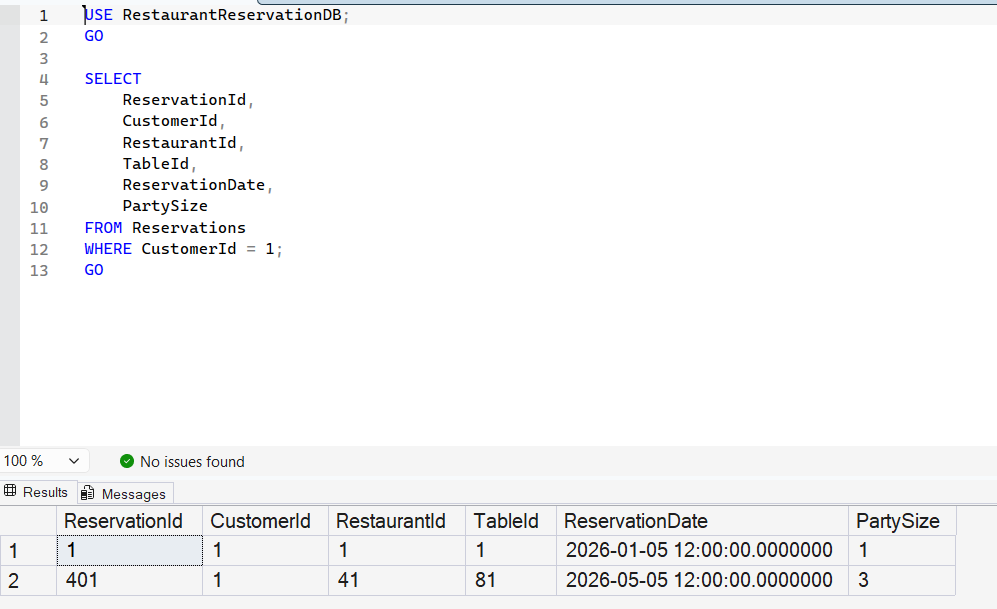

# Query 1: List Customer Reservations

## Requirement

Retrieve all reservations for a specific customer.

## SQL File

[View SQL Query](../../database/queries/01-list-customer-reservations.sql)

## Description

This query retrieves all reservations belonging to a specific customer by filtering the `Reservations` table using `CustomerId`.

In this example, the query retrieves reservations for the customer whose ID is `1`.

## Result

