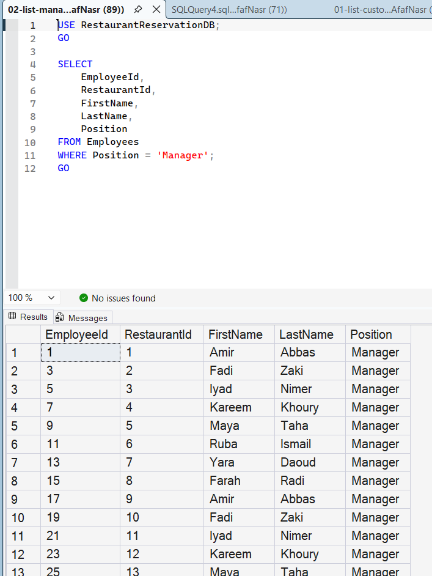

# Query 2: List of Managers

## Requirement

Retrieve all employees holding the Manager position.

## SQL File

[View SQL Query](../../database/queries/02-list-managers.sql)

## Description

This query retrieves all employees whose position is `Manager` from the `Employees` table.

## Rationale

The `Position` column stores the role assigned to each employee. Therefore, the query uses a `WHERE` condition to return only employees whose position is equal to `Manager`.

## Result

