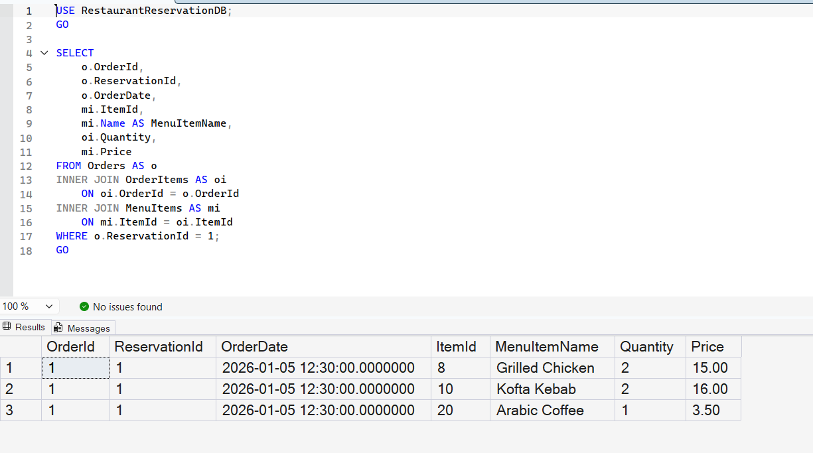

# Query 3: Orders and Menu Items for a Reservation

## Requirement

List the orders placed for a specific reservation along with the associated menu items.

## SQL File

[View SQL Query](../../database/queries/03-reservation-orders-menu-items.sql)

## Description

This query retrieves the orders associated with a specific reservation and displays the menu items included in each order.

The reservation is selected using its `ReservationId`.

## Rationale

The required data is stored across three related tables:

- `Orders` stores the order and its associated reservation.
- `OrderItems` connects each order to its menu items and stores the quantity.
- `MenuItems` stores the menu item name and price.

Therefore, `INNER JOIN` is used to combine these tables and return the complete order details.

The `WHERE` condition filters the results so that only orders belonging to the specified reservation are returned.

## Result

