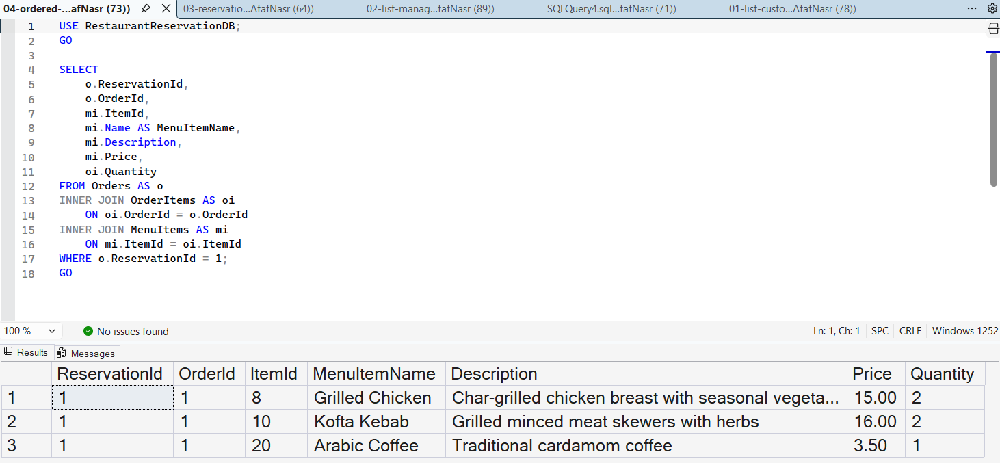

# Query 4: Ordered Menu Items

## Requirement

List the menu items ordered by a specific reservation.

## SQL File

[View SQL Query](../../database/queries/04-ordered-menu-items.sql)

## Description

This query retrieves the menu items ordered for a specific reservation, including each item's name, description, price, and ordered quantity.

The reservation is selected using its `ReservationId`.

## Rationale

The reservation is connected to its orders through the `Orders` table. The `OrderItems` table connects each order to the menu items included in it, while the `MenuItems` table stores the details of each item.

Therefore, `INNER JOIN` is used to combine the three tables. The `WHERE` condition returns only the menu items associated with the specified reservation.

## Result

