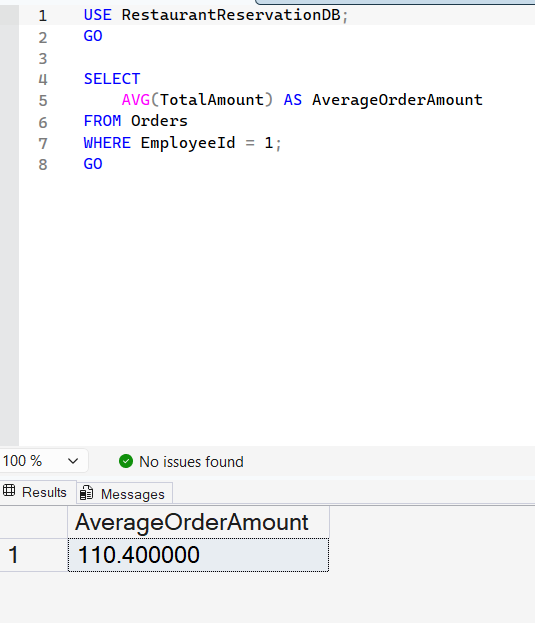

# Query 5: Average Order Amount by Employee

## Requirement

Calculate the average order amount made through a specific employee.

## SQL File

[View SQL Query](../../database/queries/05-average-order-amount-by-employee.sql)

## Description

This query calculates the average value of all orders handled by a specific employee.

The employee is selected using the `EmployeeId`.

## Rationale

The `Orders` table stores both the employee responsible for each order and the total order amount. Therefore, the query filters orders by `EmployeeId` and uses the `AVG` aggregate function to calculate the average order amount.

## Result

