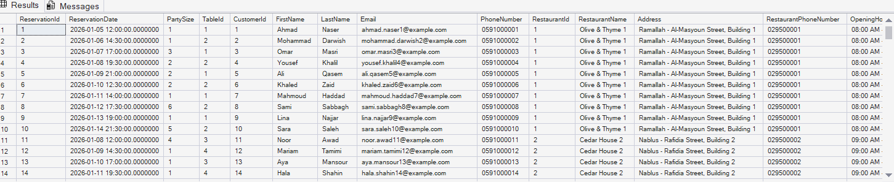

# Query 7: Retrieve Employees Report Using a View

## Requirement

Retrieve Employees Details with Views: Use a view to list all employees information including their restaurant details.

## SQL Files

- [View Definition](../../database/views/02-create-employees-report-view.sql)
- [Report Query](../../database/queries/07-retrieve-employees-report.sql)

## Description

This query retrieves a complete employees report from the `vw_EmployeesReport` view.

The view combines employee information with the details of the restaurant where each employee works. The report is then retrieved using a simple `SELECT` statement.

## Rationale

Employee information is stored in the `Employees` table, while restaurant information is stored in the `Restaurants` table.

The `RestaurantId` foreign key in the `Employees` table connects each employee to their restaurant. Therefore, an `INNER JOIN` is used to combine employee and restaurant information.

A view is used because the requirement asks for a reusable employees report. The view stores the query definition, allowing the report to be retrieved without rewriting the join.

## Result

