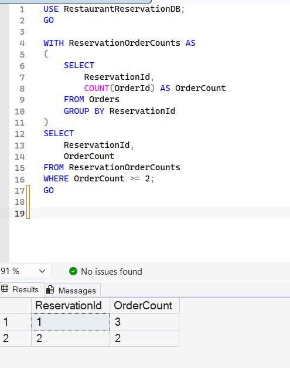

# Query 8: Reservations with Two or More Orders Using a CTE

## Requirement

Reservation’s Order with CTEs: Identify reservations which have 2 or more orders using CTEs.

## SQL File

[View SQL Query](../../database/queries/08-reservations-with-multiple-orders.sql)

## Description

This query identifies reservations that have two or more associated orders.

A Common Table Expression named `ReservationOrderCounts` calculates the number of orders for each reservation. The final query filters the CTE result and returns only reservations with an order count greater than or equal to two.

## Rationale

Each order is connected to a reservation through the `ReservationId` column in the `Orders` table.

The query groups orders by `ReservationId` and uses the `COUNT` aggregate function to calculate the number of orders for each reservation.

A CTE is used because the requirement explicitly asks for one. It separates the order-counting logic from the final filtering query, making the query easier to read and understand.

## Result

