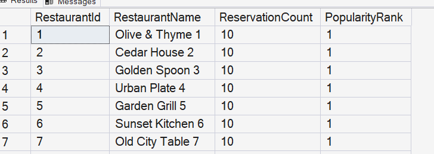

# Query 9: Restaurant Popularity Ranking

## Requirement

Restaurant Popularity using Aggregation: Rank restaurants by the reservation frequency.

## SQL File

[View SQL Query](../../database/queries/09-restaurant-popularity-ranking.sql)

## Description

This query ranks restaurants according to the number of reservations associated with each restaurant.

It counts the reservations for every restaurant and assigns a popularity rank, where the restaurant with the highest reservation count receives rank one.

## Rationale

Restaurant information is stored in the `Restaurants` table, while reservation records are stored in the `Reservations` table.

A `LEFT JOIN` is used to include all restaurants, even restaurants that currently have no reservations.

The query groups the records by restaurant and uses `COUNT` to calculate reservation frequency. The `RANK` window function assigns each restaurant a rank based on its reservation count in descending order.

## Result

