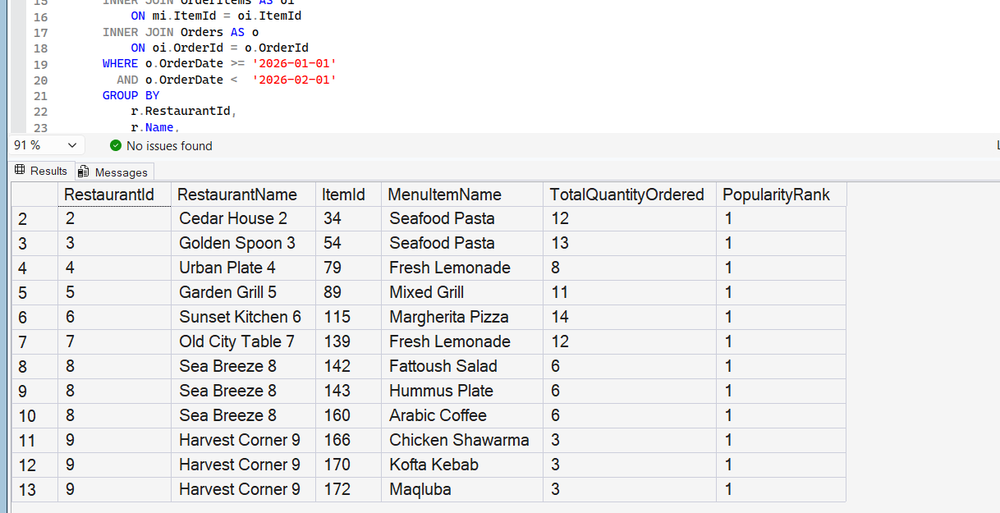

# Query 10: Popular Menu Item Analysis

## Requirement

Popular Menu Item Analysis using Joins and Window Functions: Identify the most popular menu item for each restaurant for a given month.

## SQL File

[View SQL Query](../../database/queries/10-popular-menu-item-analysis.sql)

## Description

This query identifies the most popular menu item for each restaurant during a specified month.

Menu item popularity is determined using the total quantity ordered. The query calculates the total ordered quantity of every menu item and ranks the items separately within each restaurant.

Only menu items assigned the first popularity rank are included in the final result.

## Rationale

The information required for this report is distributed across several related tables:

- `Restaurants` stores restaurant information.
- `MenuItems` stores the menu items offered by each restaurant.
- `OrderItems` connects menu items to orders and stores their ordered quantities.
- `Orders` stores the order date used to filter the results by month.

The query uses `INNER JOIN` to combine these related records.

The first CTE groups the records by restaurant and menu item and uses `SUM` to calculate the total quantity ordered during the selected month.

The second CTE uses the `RANK` window function with `PARTITION BY RestaurantId` to rank menu items independently within each restaurant.

The final query selects records with `PopularityRank = 1`, representing the most popular menu item for each restaurant. Using `RANK` also allows multiple menu items to be returned when they have the same highest ordered quantity.

## Result

