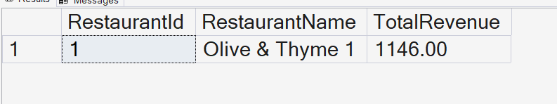

# Query 11: Calculate Restaurant Revenue Using a Function

## Requirement

Database Function - Calculate Restaurant Revenue:

- Function Name: `fn_CalculateRevenue`
- Purpose: Compute revenue made by a specific restaurant.
- Parameter: `RestaurantId`
- Return: Total revenue amount for the specified restaurant.

## SQL Files

- [Function Definition](../../database/functions/01-create-calculate-revenue-function.sql)
- [Function Query](../../database/queries/11-calculate-restaurant-revenue.sql)

## Description

This query calls the `fn_CalculateRevenue` scalar function to calculate the total revenue generated by a specific restaurant.

The function accepts a `RestaurantId` parameter and returns the sum of all order amounts associated with reservations made at that restaurant.

## Rationale

The restaurant identifier is stored in the `Reservations` table, while the order amount is stored in the `Orders` table.

Therefore, the function joins `Reservations` with `Orders` using `ReservationId`.

It then filters the records by the provided `RestaurantId` and uses `SUM` to calculate the total restaurant revenue.

The `COALESCE` function returns zero when the restaurant has no associated orders instead of returning `NULL`.

A scalar-valued function is used because the requirement asks for a reusable database function that returns one total revenue value for a specific restaurant.

## Result

