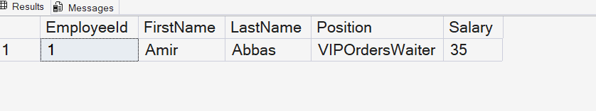

# Query 12: Calculate Employee Salary Using a Function

## Requirement

Database Function - Calculate Employees Salary

- Function Name: `fn_CalculateEmployeeSalary`
- Purpose: Compute the salary for a given employee.
- Parameter: `EmployeeId`
- Return: Salary for the specified employee.

## SQL Files

- [Function Definition](../../database/functions/02-create-calculate-employee-salary-function.sql)
- [Function Query](../../database/queries/12-calculate-employee-salary.sql)

## Description

This query calls the `fn_CalculateEmployeeSalary` function to calculate the salary of a specific employee.

The salary is calculated by multiplying the number of orders handled by the employee by a rank value determined from the employee's position.

## Rationale

The number of orders is obtained from the `Orders` table using the employee identifier.

The employee's position is retrieved from the `Employees` table and converted into a numeric rank using a `CASE` expression.

Finally, the function multiplies the total number of orders by the employee's rank and returns the calculated salary.

## Result

