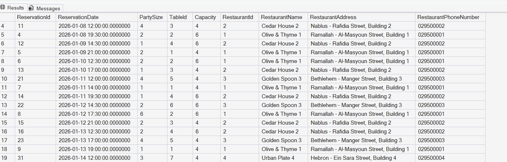

# Query 13: Reserved Tables Report Using a Stored Procedure

## Requirement

Stored Procedure :

- Procedure Name: `sp_ResrvedTablesReport`
- Purpose: Generate a report of tables reserved within a specified date range.
- Parameters: `StartDate`, `EndDate`
- Implementation: Retrieve all tables reserved within the given range, including reservation date, party size, and restaurant details.

## SQL Files

- [Stored Procedure Definition](../../database/procedures/01-create-reserved-tables-report-procedure.sql)
- [Procedure Execution Query](../../database/queries/13-reserved-tables-report.sql)

## Description

This query executes the `sp_ResrvedTablesReport` stored procedure to generate a report of tables reserved within a specified date range.

The report includes reservation details, table information, and the details of the restaurant associated with each reservation.

## Rationale

Reservation details are stored in the `Reservations` table, table information is stored in the `Tables` table, and restaurant information is stored in the `Restaurants` table.

The stored procedure uses `INNER JOIN` to combine these related tables.

The `StartDate` and `EndDate` parameters allow the report period to be selected when the procedure is executed.

The ending date is increased by one day and used with the `<` operator so that all reservations occurring throughout the final day are included.

A stored procedure is appropriate because the requirement asks for a reusable report that accepts input parameters and returns multiple rows.

## Result

