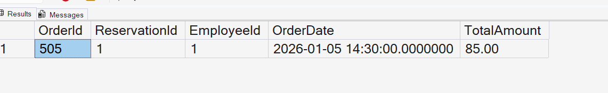

# Query 14: Add New Order Using a Stored Procedure

## Requirement

Stored Procedure - Add New Order:

- Procedure Name: `sp_AddNewOrder`
- Purpose: Streamline the process of adding a new order.
- Parameters:
  - `ReservationId`
  - `EmployeeId`
  - `OrderDate`
  - `TotalAmount`
- Implementation: Verify that the specified reservation and employee exist before inserting the order.
- Return: The newly created `OrderId` or an error message.

## SQL Files

- [Stored Procedure Definition](../../database/procedures/02-create-add-new-order-procedure.sql)
- [Procedure Execution Query](../../database/queries/14-add-new-order.sql)

## Description

This query executes the `sp_AddNewOrder` stored procedure to add a new order to the database.

The procedure accepts reservation, employee, order date, and total amount values. It validates the referenced reservation and employee before inserting the new order.

After a successful insertion, the procedure returns all details of the newly created order, including its generated `OrderId`..

## Rationale

The `Orders` table references both the `Reservations` and `Employees` tables. Therefore, the procedure checks that the provided `ReservationId` and `EmployeeId` exist before inserting the new record.

If either record does not exist, the procedure uses `THROW` to return a clear error message and stops execution.

If both records exist, the procedure inserts the order and uses `SCOPE_IDENTITY` to retrieve the generated `OrderId`.

A stored procedure is appropriate because this requirement represents a reusable database operation that includes validation, insertion, and result handling.

## Result

