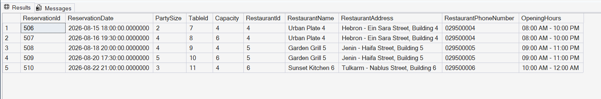

# Query 15: Future Reserved Tables Using a Temporary Table

## Requirement

SQL Stored Procedure with Temp Table:

Design a stored procedure that retrieves all tables which have future reservations. Store these tables in a temporary table, then join the temporary table with the `Restaurants` table to display information about the associated restaurants.

## SQL Files

- [Stored Procedure Definition](../../database/procedures/03-create-future-reserved-tables-procedure.sql)
- [Procedure Execution Query](../../database/queries/15-future-reserved-tables.sql)

## Description

This query executes the `sp_FutureReservedTables` stored procedure.

The procedure retrieves reservations whose reservation dates are later than the current date and stores their table, reservation, and restaurant identifiers in a temporary table.

The temporary table is then joined with the `Tables` and `Restaurants` tables to display complete information about the future reserved tables and their associated restaurants.

## Rationale

Future reservations are identified by comparing `ReservationDate` with the current date using `GETDATE()`.

A temporary table named `#FutureReservedTables` is used because the requirement explicitly asks to temporarily store the future reserved tables before generating the final report.

The temporary table stores the information needed for the report, including `TableId` and `RestaurantId`.

It is then joined with:

- `Tables` to retrieve table capacity.
- `Restaurants` to retrieve restaurant details.

The temporary table exists only during the execution of the stored procedure and is automatically removed after the procedure finishes.

## Result

