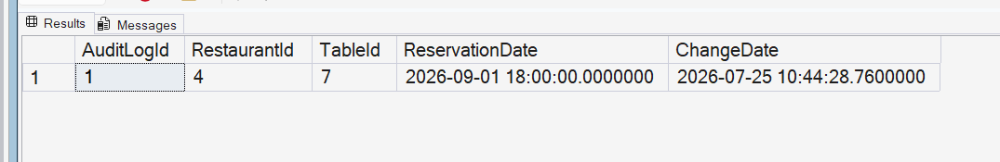

# Query 16: Reservation Audit Trigger

## Requirement

Design a trigger that logs an entry into a separate `AuditLog` table whenever a table is reserved.

The audit record should capture:

- `RestaurantId`
- `TableId`
- `ReservationDate`
- `ChangeDate`

## SQL Files

- [AuditLog Table Definition](../../database/tables/09-create-audit-log-table.sql)
- [Trigger Definition](../../database/triggers/01-create-reservation-audit-trigger.sql)
- [Trigger Test Query](../../database/queries/16-test-reservation-audit-trigger.sql)

## Description

This implementation creates an `AuditLog` table and an `AFTER INSERT` trigger on the `Reservations` table.

Whenever one or more reservations are inserted, the trigger automatically records their restaurant, table, and reservation date in the audit table.

The `ChangeDate` stores the date and time when the reservation was inserted.

## Rationale

A new table reservation is represented by inserting a record into the `Reservations` table.

Therefore, an `AFTER INSERT` trigger is used to perform the auditing operation after the reservation has been successfully added.

The trigger reads the new reservation records from SQL Server's logical `inserted` table. This design supports both single-row and multiple-row insert operations.

## Result

