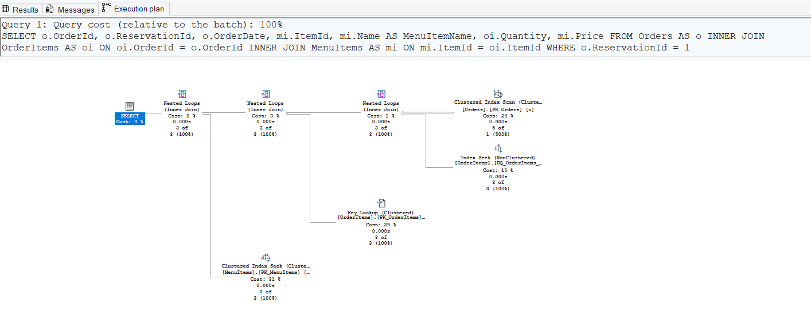
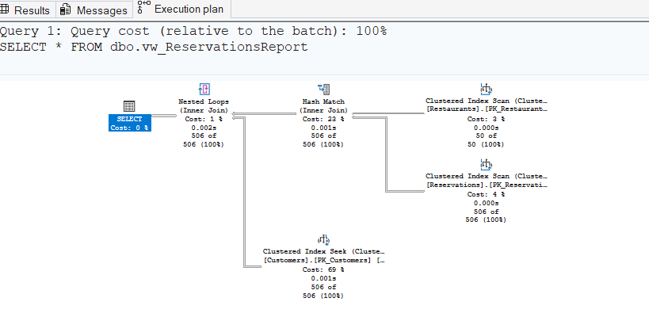
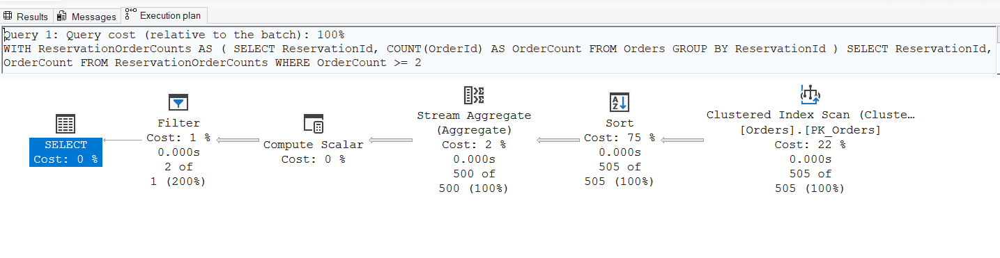
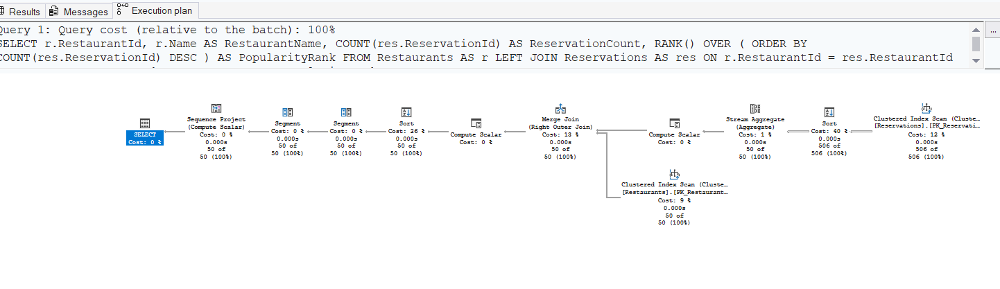
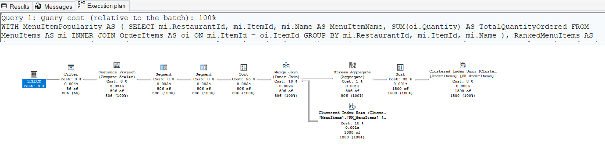

# Query Plans - Part 1

## Query 1: Orders and Menu Items

### SQL Query

```sql
SELECT
    o.OrderId,
    o.ReservationId,
    o.OrderDate,
    mi.ItemId,
    mi.Name AS MenuItemName,
    oi.Quantity,
    mi.Price
FROM Orders AS o
INNER JOIN OrderItems AS oi
    ON oi.OrderId = o.OrderId
INNER JOIN MenuItems AS mi
    ON mi.ItemId = oi.ItemId
WHERE o.ReservationId = 1;
```
### Execution Plan



### Analysis

The execution plan reads the Orders table using a Clustered Index Scan to locate the order associated with the specified reservation.

It then uses a Nonclustered Index Seek on the OrderItems table to efficiently locate the order items related to the matching order.

A Key Lookup is performed on the clustered index of OrderItems to retrieve additional columns that are not included in the nonclustered index. This operation has the highest estimated cost in the plan, at approximately 29%.

SQL Server uses Nested Loops operators to join the small number of matching rows from Orders, OrderItems, and MenuItems.

The use of Nested Loops is suitable in this case because the query returns only a small number of rows.

## Query 2: Reservations Report View

### SQL Query

```sql
SELECT *
FROM dbo.vw_ReservationsReport;
```

### Execution Plan



### Analysis

The execution plan expands the `vw_ReservationsReport` view and executes the underlying query on the base tables.

SQL Server reads the `Restaurants` table using a Clustered Index Scan and reads the `Reservations` table using another Clustered Index Scan.

It then uses a Hash Match (Inner Join) to combine the matching rows from the `Restaurants` and `Reservations` tables.

After that, SQL Server uses a Clustered Index Seek on the `Customers` table to retrieve the related customer records.

Finally, a Nested Loops (Inner Join) operator combines the customer data with the previously joined reservation and restaurant data.

The highest estimated costs in the plan are the Clustered Index Scan on the `Restaurants` table at approximately 50% and the Clustered Index Seek on the `Customers` table at approximately 49%.

## Query 3: Reservations Having Two or More Orders

### SQL Query

```sql
WITH ReservationOrderCounts AS
(
    SELECT
        ReservationId,
        COUNT(OrderId) AS OrderCount
    FROM Orders
    GROUP BY ReservationId
)
SELECT
    ReservationId,
    OrderCount
FROM ReservationOrderCounts
WHERE OrderCount >= 2;
```

### Execution Plan



### Analysis

The execution plan reads the `Orders` table using a Clustered Index Scan to retrieve all order records.

SQL Server then performs a Sort operation before applying the aggregation. The Sort operator has the highest estimated cost in the execution plan at approximately 75%.

Next, a Stream Aggregate operator groups the rows by `ReservationId` and calculates the number of orders for each reservation using the `COUNT` aggregate function.

A Compute Scalar operator prepares the calculated values required by the query.

Finally, a Filter operator returns only the reservations whose order count is greater than or equal to two.

The CTE does not appear as a separate object in the execution plan because SQL Server integrates its logic directly into the final execution plan.

## Query 4: Restaurant Popularity

### SQL Query

```sql
SELECT
    r.RestaurantId,
    r.Name AS RestaurantName,
    COUNT(res.ReservationId) AS ReservationCount,
    RANK() OVER
    (
        ORDER BY COUNT(res.ReservationId) DESC
    ) AS PopularityRank
FROM Restaurants AS r
LEFT JOIN Reservations AS res
    ON r.RestaurantId = res.RestaurantId
GROUP BY
    r.RestaurantId,
    r.Name
ORDER BY PopularityRank;
```

### Execution Plan



### Analysis

The execution plan reads the `Reservations` table using a Clustered Index Scan and sorts the data before performing the aggregation.

A Stream Aggregate operator groups the reservations by restaurant and calculates the reservation count using the `COUNT` aggregate function.

SQL Server then reads the `Restaurants` table using another Clustered Index Scan and combines both data sets using a Merge Join operator.

Additional Sort, Segment, and Sequence Project operators are used to prepare the data and calculate the `RANK()` window function.

The highest estimated cost in the execution plan is the Sort operator at approximately 40%, which is required before calculating the ranking.

## Query 5: Popular Menu Item Analysis

### SQL Query

```sql
WITH MenuItemPopularity AS
(
    SELECT
        mi.RestaurantId,
        mi.ItemId,
        mi.Name AS MenuItemName,
        SUM(oi.Quantity) AS TotalQuantityOrdered
    FROM MenuItems AS mi
    INNER JOIN OrderItems AS oi
        ON mi.ItemId = oi.ItemId
    GROUP BY
        mi.RestaurantId,
        mi.ItemId,
        mi.Name
),
RankedMenuItems AS
(
    SELECT
        RestaurantId,
        ItemId,
        MenuItemName,
        TotalQuantityOrdered,
        RANK() OVER
        (
            PARTITION BY RestaurantId
            ORDER BY TotalQuantityOrdered DESC
        ) AS PopularityRank
    FROM MenuItemPopularity
)
SELECT
    RestaurantId,
    ItemId,
    MenuItemName,
    TotalQuantityOrdered,
    PopularityRank
FROM RankedMenuItems
WHERE PopularityRank = 1
ORDER BY RestaurantId;
```

### Execution Plan



### Analysis

The execution plan reads data from the `OrderItems` and `MenuItems` tables using Clustered Index Scan operators.

SQL Server sorts the data before performing the aggregation. A Stream Aggregate operator calculates the total ordered quantity for each menu item using the `SUM` aggregate function.

The aggregated results are combined using a Merge Join operator.

Additional Sort, Segment, and Sequence Project operators are used to partition the data and calculate the `RANK()` window function for each restaurant.

Finally, a Filter operator returns only the menu items whose popularity rank is equal to one.

The highest estimated cost in the execution plan is the Sort operator at approximately 38%, followed by another Sort operation at approximately 25%.

