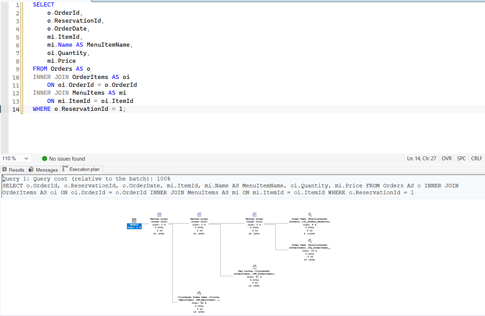
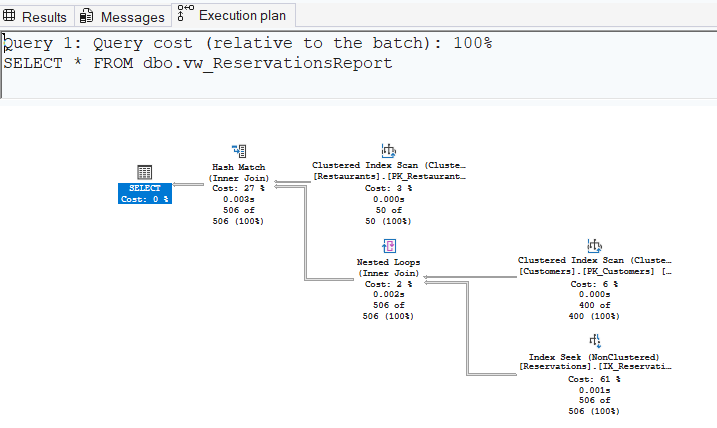
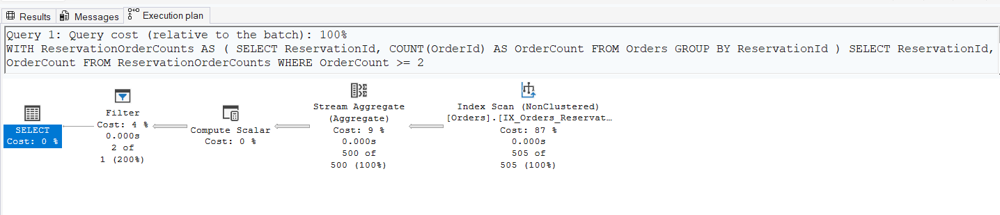
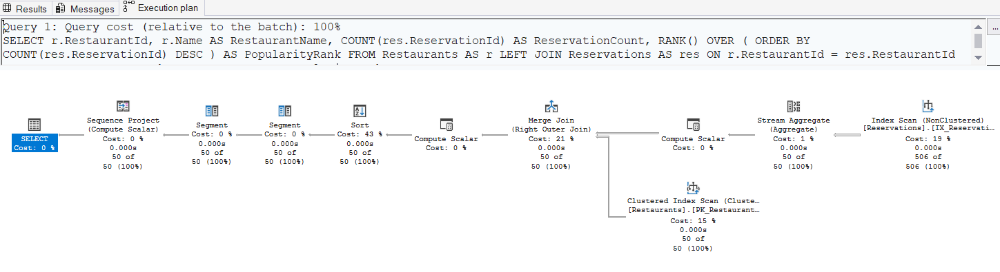
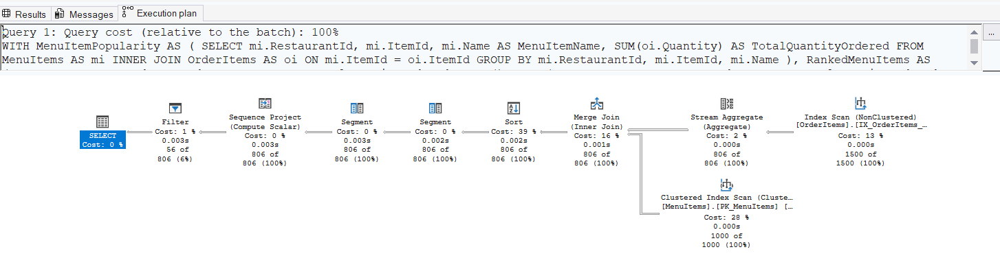

## Query 1: Orders and Menu Items

### Execution Plan After Indexing

### Analysis

After adding the indexes, SQL Server replaced the **Clustered Index Scan** on the `Orders` table with a **Nonclustered Index Seek** using the `IX_Orders_ReservationId` index.

The query also uses **Index Seeks** on the related tables, while a **Key Lookup** is still required to retrieve additional columns not covered by the index.

Overall, the execution plan became more efficient because SQL Server can locate the required rows directly instead of scanning the entire `Orders` table, resulting in improved query performance.

## Query 2: Reservations Report View

### Execution Plan After Indexing

### Analysis

After adding the indexes, SQL Server used the `IX_Reservations_RestaurantId` index to retrieve reservation records instead of scanning the `Reservations` table.

The execution plan still uses a **Clustered Index Scan** on the `Restaurants` table because the query retrieves all restaurant records without filtering.

Overall, the new execution plan is more efficient as the `Reservations` table is accessed through an **Index Seek**, reducing the amount of data that SQL Server needs to read.

## Query 3: Reservations Having Two or More Orders

### Execution Plan After Indexing

### Analysis

After adding the indexes, SQL Server used the `IX_Orders_ReservationId` nonclustered index to process the query.

The execution plan now performs an **Index Scan** on the nonclustered index instead of a clustered index scan. Since the index is ordered by `ReservationId`, SQL Server can efficiently perform the `Stream Aggregate` operation without an additional sort.

Overall, the new execution plan is more efficient because it scans the smaller nonclustered index rather than the clustered index, reducing the amount of data processed during the aggregation.

## Query 4: Restaurant Popularity

### Execution Plan After Indexing

### Analysis

After adding the indexes, SQL Server used the `IX_Reservations_RestaurantId` nonclustered index to read reservation data in an order suitable for grouping by restaurant.

The query still performs a **Clustered Index Scan** on the `Restaurants` table because all restaurants are required.

A **Sort** operation is still present and has the highest estimated cost because the `RANK()` function requires the aggregated reservation counts to be ordered.

Overall, the index improved access to the `Reservations` data, while the remaining sort is necessary for calculating the popularity ranking.

## Query 5: Popular Menu Item Analysis

### Execution Plan After Indexing

### Analysis

After adding the indexes, SQL Server used the `IX_OrderItems_ItemId` nonclustered index to access the `OrderItems` table during the aggregation process.

The execution plan still performs a **Clustered Index Scan** on the `MenuItems` table because the query processes all menu items. A **Sort** operation remains necessary to calculate the `RANK()` function after the aggregation.

Overall, the execution plan is more efficient because SQL Server uses the nonclustered index to process `OrderItems`, reducing the amount of data accessed during the aggregation.
